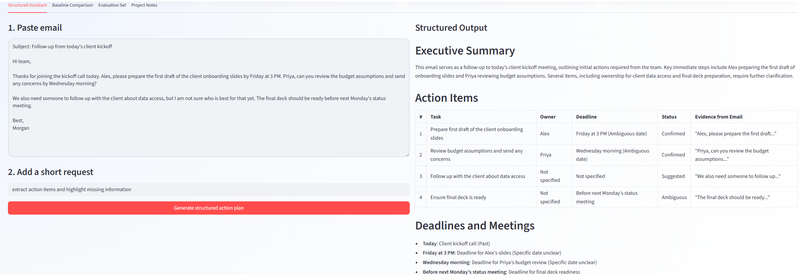

# Email Action Plan Assistant

A small GenAI web app for one focused business workflow: turning a pasted business email into an execution-ready action plan.

## 1. Context, User, and Problem

The target user is a business student, team member, or early-career professional who regularly receives emails containing requests, follow-up tasks, deadlines, or coordination details.

The workflow starts when the user receives a long or informal business email and ends when the user has a clear view of:

- what needs to be done
- who owns each task
- when each task is due
- what information is missing or ambiguous

This problem matters because missed action items can lead to delays, unclear ownership, and poor coordination. A normal email summary may explain the topic of the message, but it often does not create an actionable plan.

## 2. Solution and Design

I built a Streamlit web app called **Email Action Plan Assistant**.

The app has four tabs:

1. **Structured Assistant** — the main GenAI workflow
2. **Baseline Comparison** — compares the improved assistant with a simple summary prompt
3. **Evaluation Set** — shows the test emails and expected good output
4. **Project Notes** — explains the project design and governance controls

### Main User Flow

1. Paste one business email into the large email input box.
2. Enter a short chat-style request, such as:
   - `extract action items`
   - `show deadlines only`
   - `who owns each task?`
   - `summarize this into a plan`
3. Click **Generate structured action plan**.
4. Review the output sections:
   - Executive Summary
   - Action Items
   - Deadlines and Meetings
   - Missing or Ambiguous Information
   - Suggested Reply

### Why GenAI Is Useful

This task is a good fit for GenAI because business emails are written in natural language. Tasks may be implied, mixed with background information, or written in different styles. A rule-based keyword system would struggle because the same action can be expressed in many ways.

The GenAI assistant uses a structured LLM call with:

- a system role
- the pasted email as context
- the user's short request as context
- required output sections
- rules for uncertainty handling

### Course Concepts Integrated

#### Anatomy of an LLM Call

The app uses a system prompt, task prompt, model choice, temperature control for the OpenAI option, and explicit output constraints. The prompt tells the model not to invent missing owners, dates, or requirements.

#### Context Engineering

The app combines two pieces of context: the pasted email and the user's short chat-style request. This lets the same email support different workflows, such as full action-plan extraction or a deadline-only view.

#### Evaluation Design

The project includes a small realistic evaluation set, a baseline comparison, and a rubric. The evaluation checks whether the structured assistant is more execution-ready than a generic email summary.

## 3. Baseline Comparison

The baseline is a simple LLM prompt:

```text
Summarize this email in a normal free-form paragraph. Do not use a table.
```

The baseline can explain the general topic of the email, but it does not require task fields, owner labels, deadlines, ambiguity handling, or suggested replies.

The structured assistant is compared against this baseline using the same email examples.

## 4. Evaluation and Results

### Test Cases

The evaluation set contains eight synthetic business emails:

1. Clear task assignment
2. Tasks without deadlines
3. Long mixed email with background information
4. User asks for a filtered output
5. Vague ownership
6. Indirect deadline
7. FYI email with no real action item
8. Multiple owners and ambiguous optional task

### Rubric

Each output is scored from 1 to 5 on five criteria:

| Criterion | What good output means |
|---|---|
| Completeness | Captures all major action items |
| Accuracy | Correctly interprets tasks, owners, deadlines, and status |
| Hallucination Control | Does not invent unsupported information |
| Missing Information Handling | Clearly marks unclear fields as `Not specified` or `Ambiguous` |
| Usability | Output is easier to act on than a free-form summary |

### Summary Results

| Metric | Structured Assistant | Baseline Summary |
|---|---:|---:|
| Completeness | 4.4 | 3.1 |
| Accuracy | 4.3 | 3.5 |
| Hallucination Control | 4.6 | 3.2 |
| Missing Information Handling | 4.5 | 2.4 |
| Execution Usability | 4.7 | 3.0 |
| Average | 4.5 | 3.0 |

The structured assistant performed better because it made tasks, owners, deadlines, and ambiguity visible. The largest improvement was missing-information handling. The baseline often produced readable summaries but did not consistently tell the user what still needed clarification.

### Where the Project Can Fail

Human review is still needed when:

- the email uses vague timing, such as "soon" or "before the meeting"
- the owner is implied by team context but not stated in the email
- a sentence is only a suggestion, not a confirmed task
- the email involves high-stakes legal, financial, or HR decisions

The assistant supports task understanding, but it should not replace professional judgment.

## 5. Artifact Snapshot

The app interface includes:

- a large email paste area
- a chat-style request input
- a structured output panel
- a baseline comparison tab
- an evaluation set tab

Example output structure:

```markdown
## Executive Summary
...

## Action Items
| # | Task | Owner | Deadline | Status | Evidence from Email |
|---|------|-------|----------|--------|---------------------|

## Deadlines and Meetings
...

## Missing or Ambiguous Information
...

## Suggested Reply
...
```

## 6. Setup Instructions

### Step 1: Clone the repository

```bash
git clone <your-repo-link>
cd email_action_plan_assistant
```

### Step 2: Create and activate a virtual environment

Windows PowerShell:

```bash
python -m venv .venv
.venv\Scripts\activate
```

Mac/Linux:

```bash
python3 -m venv .venv
source .venv/bin/activate
```

### Step 3: Install dependencies

```bash
pip install -r requirements.txt
```

### Step 4: Add API key

Copy `.env.example` to `.env`:

```bash
copy .env.example .env
```

On Mac/Linux:

```bash
cp .env.example .env
```

Then add your API key inside `.env`.

Gemini option:

```text
LLM_PROVIDER=gemini
GEMINI_API_KEY=your_key_here
MODEL_NAME=gemini-2.5-flash
```

OpenAI option:

```text
LLM_PROVIDER=openai
OPENAI_API_KEY=your_key_here
OPENAI_MODEL=gpt-4o-mini
```

Do **not** commit `.env` to GitHub.

### Step 5: Run the app

```bash
streamlit run app.py
```

The app will open in a browser. Paste an email and click **Generate structured action plan**.

## 7. Running the Evaluation Materials

The test emails are in:

```text
data/eval_examples.json
```

The summary evaluation results are in:

```text
data/evaluation_results.csv
```

To create a blank manual scoring sheet, run:

```bash
python scripts/evaluate.py
```

This creates:

```text
data/manual_scoring_sheet.csv
```

## 8. Repository Contents

```text
email_action_plan_assistant/
├── app.py
├── requirements.txt
├── README.md
├── evaluation.md
├── presentation_script.md
├── .env.example
├── .gitignore
├── data/
│   ├── eval_examples.json
│   └── evaluation_results.csv
├── prompts/
│   ├── baseline_prompt.md
│   └── structured_prompt.md
└── scripts/
    └── evaluate.py
```

## 9. Privacy and Governance

This project uses synthetic emails only. Do not commit private emails, API keys, confidential business data, or personally identifiable information to the repository. If the app is used in a real organization, the organization should review the LLM provider's data policies before employees paste sensitive emails into the tool.

